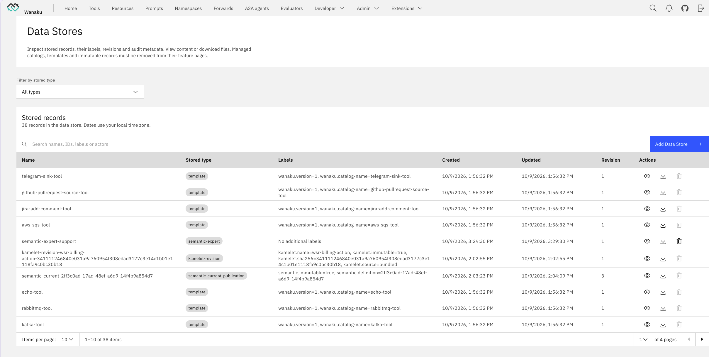

# Wanaku Barn - A Collection of Enterprise Utilities for the Wanaku Governed Execution Proxy

[](LICENSE)
[](https://github.com/wanaku-ai/wanaku/actions)
[](https://github.com/wanaku-ai/wanaku/releases)

Wanaku Barn is a collection of utilities for the [Wanaku Governed Execution Proxy](https://github.com/wanaku-ai/wanaku) (formerly known as
Wanaku MCP Router). It provides the project with the OpenShift/Kubernetes operator for simplified deployment on the
cloud, a CLI that helps manage the project and tools for simplifying the administration of credentials when using
Keycloak.

## Quick Start

The quickest way to run Wanaku Barn is to install it as a plugin in Wanaku. It is already listed in the 
default catalog. When asked for the configuration, provide the address on which Wanaku Barn listens to (<http://localhost:8180>). 

Once installed, select one of the Wanaku Barn backend deliverables from the [releases page](https://github.com/wanaku-ai/wanaku-barn/releases),
unpack it and launch the process:

```shell
java -jar apps/wanaku-barn-backend/target/quarkus-app/quarkus-run.jar
```

You should see an Extensions menu, with several items. If you select, for instance, Data Stores, you should see:



### Learn Wanaku

The easiest way to learn Wanaku is by following the **[guided tutorial](https://wanaku.ai/docs/demos/)**.

### Basic Usage

The reference documentation, including the complete installation and configuration instructions, is available on the [usage guide](https://wanaku.ai/docs/version/).

## Documentation

The **[Wanaku Documentation](https://wanaku.ai/docs/)** website contains additional documentation, covering several of
components that are part of the project - some of which are hosted in different repositories (i.e.: such as the
[Camel Integration Capability](https://github.com/wanaku-ai/camel-integration-capability/),
the [Java SDK](https://github.com/wanaku-ai/wanaku-capabilities-java-sdk/), etc.).

## Community

- [GitHub Issues](https://github.com/wanaku-ai/wanaku/issues) - Bug reports and feature requests
- [Discussions](https://github.com/wanaku-ai/wanaku/discussions) - Ask questions and share ideas

Contributors working on the project may want to refer to the [development version of the documentation](/docs) including

- [Pre-release Usage Guide](docs/usage.md) - Pre-release usage guide
- [Architecture](docs/architecture.md) - System architecture and components
- [Building](docs/building.md) - Build and package the project
- [Deployment Debugger](docs/deployment-debugger.md) - Inspect deployed MCP servers from Wanaku
- [Audit Trail](docs/audit-trail.md) - Durable record of changes to Barn-managed resources
- [Backup, Restore and Upgrade](docs/backup-and-upgrade.md) - Export, import and schema migrations
- [Agent Skills](docs/agent-skills.md) - Skills that teach coding agents how to use Wanaku
- [Contributing](CONTRIBUTING.md) - Contribution guidelines
- [Security](SECURITY.md) - Security policy and best practices

## License

This project is licensed under the Apache 2.0 License - see the [LICENSE](LICENSE) file for details.
